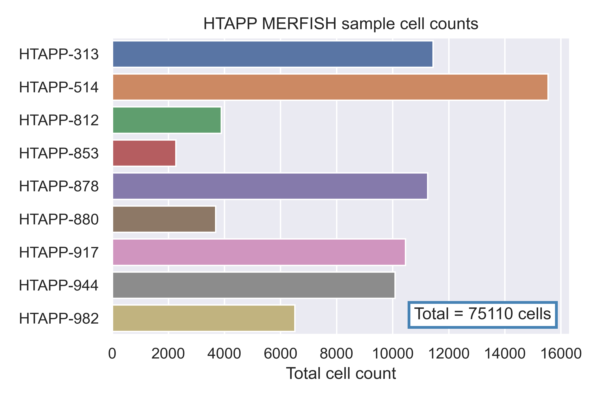

# Evaluating methods for integrating scRNA-seq and spatial transcriptomics data using publicly available cancer datasets

### Human Tumor Atlas Network (HTAN) Data Jamboree | Dec. 4-7, 2023 

## Background

## About the data 

The data used in this project were accessed using the [HTAN Data Portal](https://humantumoratlas.org/explore), and were generated as part of the [Human Tumor Atlas Pilot Project](https://humantumoratlas.org/hta1) (HTAPP). A manuscript describing and analyzing some of the samples from this dataset is currently in [pre-print on BioRxiv](https://doi.org/10.1101/2023.03.21.533680).

Analyzed here are paired scRNA-seq and MERFISH datasets from 9 samples derived from patients with various subtypes of metastatic breast cancer. 

## Analysis goals 

- Integrate the data 
- Transfer cell type labels between modalities 
- Determine which method works best for this particular problem 
- Draw novel biological conclusions from the integrated dataset 

## Basic workflow 

- Data ingress and pre-processing 
- Integration: `Method 1`
- Integration: `Method 2`
- Evaluation
- Downstream analysis

## Results 

## Future directions 

## Team 

- **John Duc Nguyen**, Genentech 
- **Jon Akutagawa**, University of California, San Francisco
- **Xiyue Zhao**, Oregon Health and Science University
- **Mark Dane**, Oregon Health and Science University
- **Cameron Watson**, Oregon Health and Science University
- **Gautam Machiraju**, Stanford University
