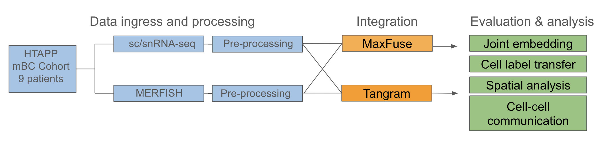

# Evaluating methods for integrating scRNA-seq and MERFISH spatial transcriptomics data using publicly available cancer datasets

### Human Tumor Atlas Network (HTAN) Data Jamboree | Dec. 4-7, 2023 

---

Here, we explore integration methods to leverage the complementary advantages of scRNA-seq and MERFISH spatial transcriptomic technologies. scRNA-seq enables whole transcriptome profiling at the single cell level, but does not preserve the spatial context of the tissue. MERFISH provides transcript signatures for single cells while preserving cell spatial information within a tissue, but is limited in transcript panel size and sequencing depth. Integrating the two assays that were run on paired samples from an HTAN metastatic breast cancer cohort allows us to 1. evaluate the best tools for integrating this type of data, and 2. elucidate new biological insights not previously established by analyzing the modalities separately. 

*Disclaimer* This work was done over a very short period for a hackathon, and represents a preliminary effort. With this in mind, code is not optimized, and there is ample room for further work. 

---

## Background

scRNA-seq allows for profiling of the entire transcriptome at the single cell level, but fails to preserve spatial information within the respective tissue. The development of spatial transcriptomic assays solves this issue by directly profiling of RNA transcripts from a tissue, thus preserving the spatial information. However, [current image-based spatial transcriptomic (ST) assays](https://www.nature.com/articles/s41592-022-01409-2) are limited to the number of genes they can profile and sequencing depth. There is motivation to integrate scRNA-seq data and ST data to leverage the strengths of each technology. Many computational tools and algorithms have been developed to carry out the integration process, but use different approaches. For instance, [MaxFuse](https://www.nature.com/articles/s41587-023-01943-0) was developed generally to integrate weakly-linked modalities through iterative joint embeddings. In contrast, [Tangram](https://www.nature.com/articles/s41592-021-01264-7) was more specifically developed for integrating scRNA-seq and spatial transcriptomics data. Here, we use both MaxFuse and Tangram to integrate scRNA-seq and MERFISH ST paired datasets, and begin to leverage the integrated data to draw novel biological conclusions. 

## About the data 

The data used in this project were accessed using the [HTAN Data Portal](https://humantumoratlas.org/explore), and were generated as part of the [Human Tumor Atlas Pilot Project](https://humantumoratlas.org/hta1) (HTAPP). A manuscript describing and analyzing some of the samples from this dataset is currently in [pre-print on BioRxiv](https://doi.org/10.1101/2023.03.21.533680).

Analyzed here are paired scRNA-seq and MERFISH datasets from 9 samples derived from patients with various subtypes of metastatic breast cancer. scRNA-seq datasets were processed using either a fresh tissue or frozen tissue protocol, which dictated the generation of scRNA-seq or snRNA-seq datasets, respectively. Experimental parameters such as isolation of cells or nuclei, fresh or frozen will affect both RNA quality and detectable transcriptome population.

Figure 1 shows total cell counts from the MERFISH samples. Each MERFISH dataset had a paired scRNA-seq dataset derived from the same biospecimen. For this project, we successfully integrated all datasets using both Tangram and MaxFuse; however, analysis was only performed on the sample **HTAPP-313** due to time contraints. Future work would involve a comprehensive comparison of the entire cohort. 

### Figure 1.

## Analysis goals 

- Integrate the data using both MaxFuse and Tangram 
- Transfer cell type labels between modalities 
- Map scRNA-seq transcriptional data into the MERFISH spatial context 
- Determine pro's and con's of each integration method  
- Draw novel biological conclusions from the integrated dataset 

## Workflow and results

### Figure 2. 

- **Data ingress**
    - HTAN level 3 and 4 data ([Learn more about the HTAN data model](https://humantumoratlas.org/standards)) for scRNA-seq and MERFISH were
      accessed using `syanpseclient`. See notebook: `data_ingress/Data_extraction.ipynb`
    - Metadata was accessed and merged with datasets using the HTAN data portal and `google-cloud-bigquery`.
- **Pre-processing**
    - Separate pre-processing pipelines were set up for MERFISH and scRNA-seq. In short these processes are described below:
    - MERFISH
        - Cell centroids were calculated for each cell from the middle slice of the 3D z-stack using the `shapely` Python package. In the
          future, using the full 3D z-stack could be an interesting course of investigation. 
          See notebook: `pre_processing/MERFISH_preprocessing.ipynb`
        - Control probes were removed from the expression matrix, all transcript counts were normalized, and cell types were annotated
          manually using Leiden clustering implemented in `scanpy`. 
          See notebook for an example on one sample: `pre_processing/MERFISH_celltype_514.ipynb`
    - scRNA-seq
        - Using `scanpy`, cells were filtered based on mitochondrial counts, genes were filtered based on expression, and transcript counts
          were normalized. Clustering and gene rankings, also implemented in `scanpy`, were used to validate cell type labels that were available in the HTAN metadata. 
          See notebook: `pre_processing/preprocess_scrna.ipynb`
- **Integration**
    - MaxFuse Integration 
        - Shared features were found across the two modalities and stored as an array, and a subset of highly variable shared features were
          used as initial linkages for integration. Separate "active" arrays were created with non-overlapping features that would be used in the iterative refinement step of the MaxFuse pipeline ([See MaxFuse tutorial](https://maxfuse.readthedocs.io/en/latest/tutorials.html)). Since cell type labels were already generated for both modalities, these were input as labels into the main MaxFuse object. Data were split into batches for nearest-neighbor graph construction to reduce memory burden. The number of Principle Components to use for graph construction were determined for each assay using the elbow method.
          See notebook: `integration/merfish_scRNAseq_MaxFuse.ipynb`
    - Tangram Integration 
        - The MERFISH and scRNA-seq data were read in `anndata` format using `scanpy`. Tangram's custom pre-processing tool was used to find
          shared features across the two modalities. Training was performed using all shared features. The Tangram functions `tg.map_cells_to_space()` and `tg.project_genes()` were used to integrate the data and map scRNA-seq cells and gene expression to the MERFISH spatial context ([See the Tangram Github repository for docs and tutorials](https://github.com/broadinstitute/Tangram)). 
          See notebook: `integration/tangram_integration.ipynb`
- **Evaluation & Downstream analysis**
    - Briefly, a number of downstream analyses were conducted to:
        1. Attempt to assess the quality of the intergation by both MaxFuse and Tangram 
        2. Draw biological insights from the integrated datasets 
    - UMAP plots, implemented in `scanpy` were generated to assess the quality of integration. The UMAP plots were colored by cell-type
      annotations, generated on the two modalities separately, on both the pre-integration and post-integration data. UMAP plots were also color annotated by the modality that each cell originated from on both the pre-integration and post-integration data. In both cases, the integration seemed to successfully remove the effect of the modalities in UMAP space (Figure 3). Additionally, after integration, cell type annotations from the two modalities overlapped on UMAP plot. For example, the separate `Macrophage` and `Monocyte` annotations were generated using the scRNA-seq data, and the `Macrophage_Monocyte` annotation was generated on the MERFISH data since the MERFISH panel did not have the genes to differentiate these lineages. The arrows (Figure 3) show these populations clustering together after integration of the modalities, suggesting that the integration removes the effect of modality, but maintains biological variation by cell type. Similarly, we created a UMAP plot for the Tangram scRNA-seq gene expression that was imposed onto the MERFISH data (Figure 4), and annotated using the original MERFISH labels. This figure shows that the MERFISH labels were recapitulated when clustering the integrated scRNA-seq data. 
      See notebooks: `integration/merfish_scRNAseq_MaxFuse.ipynb` and `downstream_analysis/post_tangram_clustering.ipynb`

      ## Figure 3.
      

      ## Figure 4. 
      

    - For the Tangram integration, we were able to project the scRNA-seq gene expression into the MERFISH spatial context, and plot the
      MERFISH cell centroids overlaid with scRNA-seq gene expression and cell types derived from scRNA-seq. This was possible due to Tangram's built-in function `tg.project_genes()`. We plotted the original MERFISH cell type labels by their spatial coordinates (Figure 5, left) next to the scRNA-seq cell type labels projected into the MERFISH spatial context (Figure 5, right). Generally, we see that the spatial abundance patterns match well for these high level cell phenotypes at a qualitative level. In the time alloted during the hackathon, we were unable to perform the same downstream analysis for MaxFuse. It appeared that only the MaxFuse integrated latent space is returned, as opposed to projecting the scRNA-seq gene expression into the spatial context. Further work is necessary to see if we are able to perform this using the MaxFuse integrated data. 
      See notebook: `downstream_analysis/plot_merfish_spatial.ipynb`

      ## Figure 5. 
      

    - The Python package `Squidpy` was used to explore spatial cell-cell interactions in both the original MERFISH data, and the projected
      Tangram data. More work for interpreting and connecting this with other analyses is needed. 
    - The R packages `Seurat` and `CellChat` were used to create cell-cell communication networks for the scRNA-seq data, and the Tangram
      integrated data; however, more time was needed to complete the analysis. 
      See R-markdown file: `downstream_analysis/CCC_CellChat.Rmd`

## Future directions and takeaways 

    - As stated above, we were not able to use the MaxFuse integrated data to project gene expression into the spatial context, as we did 
      using Tangram. This may be possible, but would require more time to perform this analysis. 
    - Much more work is needed to quantitatively assess the integration performance of these two piplines for these data. We started
      calculating some spatial metrics to compare the Tangram projected cell types to the spatial arrangement of the original MERFISH labels, but were unable to complete this analysis in the alloted time. 
    - Other downstream analyses would include cell-cell communication, and cohort-level analysis. An example of this would be looking at gene
      expression modules or topics that vary spatially or by cell type between samples with different breast cancer subtypes or other clinical annotations. 
    - There are many directions that could build upon this work. The HTAPP dataset includes histological images that could be used to bolster
      the analysis of these datasets. Other paired datasets with scRNA-seq, spatial transcriptomics, and spatial proteomics assays would be of particular interest for a multimodal integration analysis. 
    - A major goal of the HTAN data jamboree was to generate feedback for the HTAN data portal. While all data portals have a learning curve
      for usage, the HTAN data portal was generally useable. The biggest blocker for this project was navigating multiple different metadata sources from within the HTAN data portal to establish which samples were paired between the modalities. Given that multimodal analyses are a cornerstone of the HTAN project, linking paired samples in a more intuitive way would be very helpful for future work. 

## Team 

- **John Duc Nguyen**, Genentech 
- **Jon Akutagawa**, University of California, San Francisco
- **Xiyue Zhao**, Oregon Health and Science University
- **Mark Dane**, Oregon Health and Science University
- **Cameron Watson**, Oregon Health and Science University
- **Gautam Machiraju**, Stanford University
